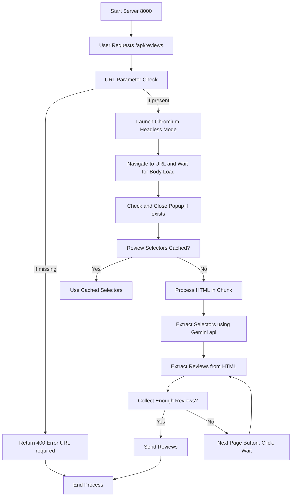

# Review Scraper

A web application that scrapes product reviews from various e-commerce websites using Playwright and Gemini , then displays them in a clean, organized interface. 

## Project Flowchart


## Demo

https://github.com/user-attachments/assets/9b540144-f515-4be2-ae03-ce9cbcdc6118

## Features

- Scrapes product reviews from any website
- Clean and responsive UI built with React and Tailwind CSS
- Real-time review fetching and display
- Use Gemini LLM to automatically identify the appropriate CSS selectors for reviews on a product page, even when the selectors are dynamically generated.
- Implement functionality to navigate through all pages of reviews, ensuring complete and thorough data extraction.
- Configurable maximum review limit
- Star rating visualization
- Error handling and loading states

## Tech Stack

- **Frontend:**
  - React for building the user interface
  - Tailwind CSS for styling
  - Vite for development server and build tool

- **Backend:**
    - Node.js and Express.js for the backend server
  - Playwright for browser automation and web scraping
  - Gemini LLM for identifying CSS selectors dynamically
  - CORS for handling cross-origin requests
  - dotenv for managing environment variables


## Prerequisites

- Node.js 16.x or higher
- npm or yarn
- Playwright
 ```bash
  npx playwright install chromium
  ```

## Installation

1. Clone the repository
2. Install dependencies:
```bash
npm install
```

## Running the Application

1. Create a `.env` file in the backend folder and store the `GOOGLE_API_KEY` there.

2. Go into the backend folder, start the backend server :
```bash
node index.js
```

3. In a separate terminal, start the frontend development server:
```bash
npm run dev
```

The application will be available at:
- Frontend: http://localhost:5173
- Backend: http://localhost:8000

## Usage

1. Open the application in your browser
2. Enter a product URL in the input field
3. Set the maximum number of reviews to fetch
4. Click "Get Reviews" to fetch and display the reviews
5. Reviews will be displayed with:
   - Reviewer name
   - Rating (in stars)
   - Review date
   - Review content

## API Endpoints

### GET /api/reviews

Fetches reviews from a specified URL.

**Parameters:**
- `url` (required): The product URL to scrape reviews from
- `maxReviews` (optional): Maximum number of reviews to fetch

**Response:**
```json
{
  "reviews_count": number,
  "reviews": [
    {
      "title": string,
      "body": string,
      "rating": number,
      "reviewer": string,
      "date": string
    }
  ]
}
```

## Test Pages

To test the implementation, here are some example product pages:

- [2717 Recovery Cream](https://2717recovery.com/products/recovery-cream)
- [Bhumi Sateen Sheet Set - Orion Blue](https://bhumi.com.au/products/sateen-sheet-set-orion-blue?variant=46405869076637)
- [Bhumi Blissful Ritual Twill Bath Sheet Bundle](https://bhumi.com.au/products/organic-cotton-blissful-ritual-twill-bath-sheet-bundle)


## Error Handling

The application handles various error cases:
- Invalid URLs
- Network errors
- Timeout errors
- Missing review elements
- Server errors

## Contributing

1. Fork the repository
2. Create a feature branch
3. Commit your changes
4. Push to the branch
5. Open a Pull Request

## License

Feel free to use this project for any purpose.
